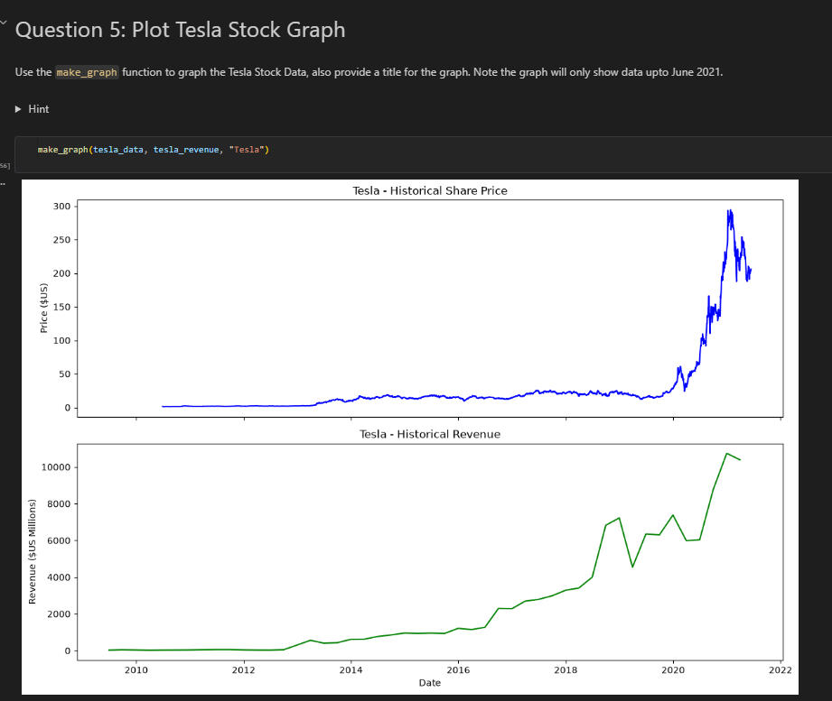
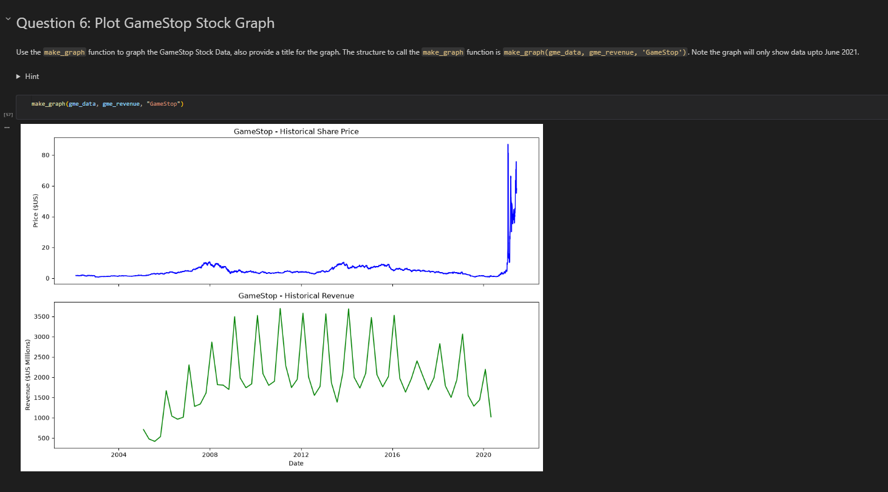

# Extracting and Visualizing Financial Data: Tesla & GameStop

## 📌 Project Overview
This project builds an automated end-to-end Python data pipeline to extract, clean, and visualize historical stock prices alongside quarterly revenue data for **Tesla (TSLA)** and **GameStop (GME)**. 

By comparing historical share prices against quarterly revenue growth on dual-axis time-series plots, this analysis evaluates whether stock price fluctuations align with core corporate financial performance or market sentiment.

---

## 🛠️ Tech Stack & Dependencies
* **Programming Language:** Python
* **API Integration:** `yfinance`
* **Web Scraping:** `requests`, `BeautifulSoup` (`bs4`)
* **Data Wrangling:** `pandas`
* **Data Visualization:** `matplotlib.pyplot`

---

## 🚀 Workflow & Key Technical Steps

### 1. Stock Data Extraction (`yfinance`)
* Extracted complete historical market data for Tesla (`TSLA`) and GameStop (`GME`) using the `yfinance` Ticker module.
* Cleaned index structures using `.reset_index(inplace=True)` for time-series alignment.

### 2. Revenue Web Scraping (`BeautifulSoup` + `requests`)
* Sent HTTP GET requests to retrieve raw HTML revenue tables.
* Parsed HTML DOM structures using `BeautifulSoup` to target specific table bodies (`<tbody>`).
* Iterated through table rows (`<tr>`) and extracted quarterly `Date` and `Revenue` cells (`<td>`).

### 3. Data Cleaning & Transformation (`pandas`)
* Applied regular expressions (`regex=True`) via `.str.replace(',|\$', "", regex=True)` to strip currency symbols (`$`) and comma formatting.
* Dropped `NaN` values and empty string entries (`""`).
* Converted cleaned values to standard numeric floats and datetime formats.

### 4. Custom Visualization Dashboard (`make_graph`)
* Developed a modular visualization function utilizing `matplotlib.pyplot.subplots(2, 1)`.
* Plotted stacked subplots sharing an x-axis up through June 2021:
  * **Top Subplot:** Historical Share Price ($US) vs. Date
  * **Bottom Subplot:** Historical Revenue ($US Millions) vs. Date

---

## 📊 Key Findings & Visual Dashboards

### 1. Tesla (TSLA) Analysis
* **Observation:** Tesla shows a strong long-term correlation between quarterly revenue growth and market valuation expansion.
* **Dashboard Output:**
  

### 2. GameStop (GME) Analysis
* **Observation:** GameStop demonstrates an extreme stock price surge in early 2021 (retail short squeeze) that occurred independently of historical revenue trends.
* **Dashboard Output:**
  

---
